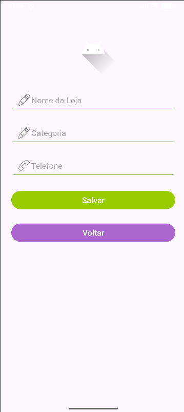
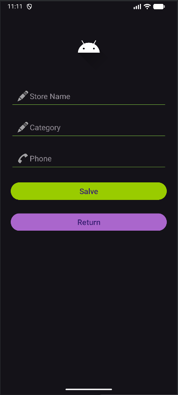
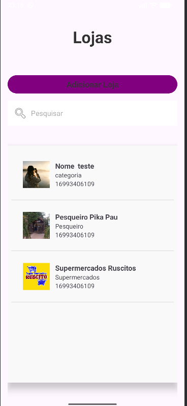
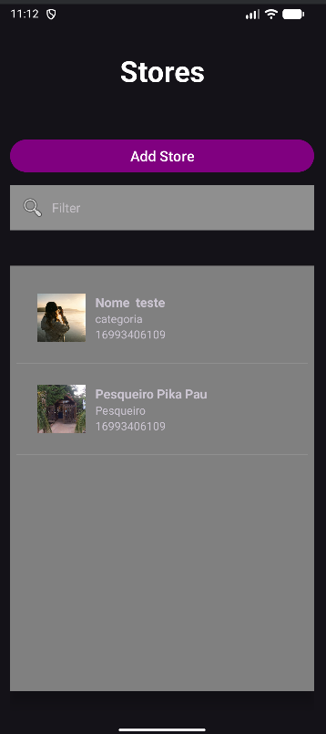

📱 Guia Pocket - Lojas de Ibaté

Projeto Prático Avaliativo
Disciplina: ARQDMO1 - Dispositivos Móveis 1
Professor: Henrique Galati
Instituição: IFSP - Campus Araraquara
Curso: Análise e Desenvolvimento de Sistemas

🗺️ Descrição do Projeto

O Guia Pocket – Lojas de Ibaté é um aplicativo Android desenvolvido em Kotlin, criado inicialmente para divulgar pequenos serviços e comércios locais. Após a boa aceitação da primeira versão e o feedback positivo da comunidade, o aplicativo passou por uma evolução funcional e estrutural, resultando em sua segunda versão (v2.0).
Esta nova versão foi desenvolvida no contexto do Projeto Prático Avaliativo do 2º Bimestre da disciplina ARQDMO1 – Dispositivos Móveis 1, com foco em melhor desempenho, persistência local de dados e funcionalidade de cadastro, atendendo às novas demandas do cliente e dos usuários finais.
O aplicativo permite a listagem dinâmica de estabelecimentos, o cadastro de novos locais diretamente pelo app, a visualização de detalhes e a realização de ligações telefônicas, além de suportar modo claro e escuro e internacionalização (português e inglês), seguindo boas práticas de design responsivo e desenvolvimento Android.

⚙️ Funcionalidades Implementadas
🧩 Lista de Serviços
- Tela principal refatorada para utilização de RecyclerView, proporcionando melhor desempenho e fluidez;
- Exibição de uma lista de locais salvos, onde cada item apresenta:
    - Imagem do estabelecimento
    - Nome do serviço
    - Categoria
- Utilização de layout personalizado para os itens da lista;
- Campo EditText para filtro em tempo real dos estabelecimentos por nome.

➕ Cadastro de Novos Estabelecimentos
- Possibilidade de adicionar novos locais por meio de uma tela dedicada (CadastroActivity), acessada via botão na tela principal;
- Formulário de cadastro permite:
- Selecionar uma imagem da galeria utilizando ActivityResultLauncher;
- Inserir os dados do estabelecimento exibidos posteriormente na tela de detalhes.
  
💾 Persistência de Dados
- Persistência local dos dados utilizando a biblioteca Room;
- Armazenamento da imagem do estabelecimento por meio de sua URI, salva como String no banco de dados;
- Dados cadastrados permanecem salvos entre as execuções do aplicativo.

🔁 Navegação e Arquitetura
- Navegação entre telas realizada por meio de Intents;
- Uso do padrão moderno de retorno de dados com ActivityResultLauncher;
- Aplicação desenvolvida integralmente em Kotlin, utilizando:
- ViewBinding em todas as telas
- ConstraintLayout como base de layout
- Organização do código em pacotes semânticos (ui, data, model, adapter, etc.)

## 🖼️ Screenshots

**Tela de Cadastro em Português e Modo Branco**  

**Tela de Cadastro em Inglês e Modo Escuro**  

**Lista de Lojas em Português e Modo Branco**  

**Lista de Lojas em Inglês e Modo Escuro**  

Link para imagens e video: https://drive.google.com/drive/folders/1vJpZwWplri_mX2lxPTHn-jMjmAvkU6GV?usp=drive_link

